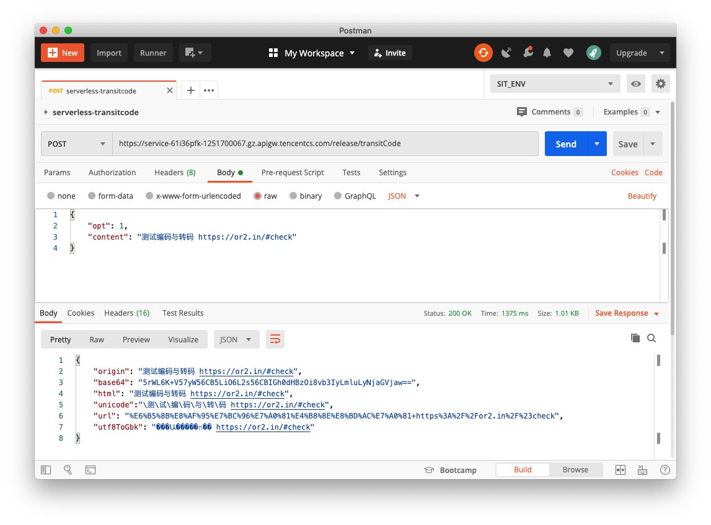

<p align="center">
  
  <br/>
  <b> 一个用于转码/加解密的 Serverless 云函数。 </b>
  <br />
  <b> a serverless application for converting codes(base64, url, html, unicode, utf8<\>GBK) </b>
</p>

## 目前支持的格式
- [X] **Base64**         加/解密 
- [X] **Html**              编码/解码
- [X] **Url**                  编码/解码
- [X] **Unicode**        编码/解码
- [X] **Utf8<=\>GBK** 编码/解码 

## 操作

根据命令行生成一个执行文件的压缩包

```console
$ chmod 755 src/build.sh
$ ./src/build.sh
```

上传压缩到「腾讯云」云函数-函数服务-函数管理-函数代码中。

## 请求结构

```json
{
    "opt": 1,
    "content": "测试编码与转码 https://or2.in/#check"
}
```

## 返回案例

```json
{
    "origin": "测试编码与转码 https://or2.in/#check",
    "base64": "5rWL6K+V57yW56CB5LiO6L2s56CBIGh0dHBzOi8vb3IyLmluLyNjaGVjaw==",
    "html": "测试编码与转码 https://or2.in/#check",
    "unicode":"\测\试\编\码\与\转\码 https://or2.in/#check",
    "url": "%E6%B5%8B%E8%AF%95%E7%BC%96%E7%A0%81%E4%B8%8E%E8%BD%AC%E7%A0%81+https%3A%2F%2For2.in%2F%23check",
    "utf8ToGbk": "���Ա�����ת�� https://or2.in/#check"
}
```

## 展示


